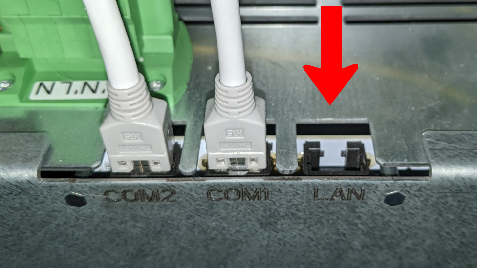
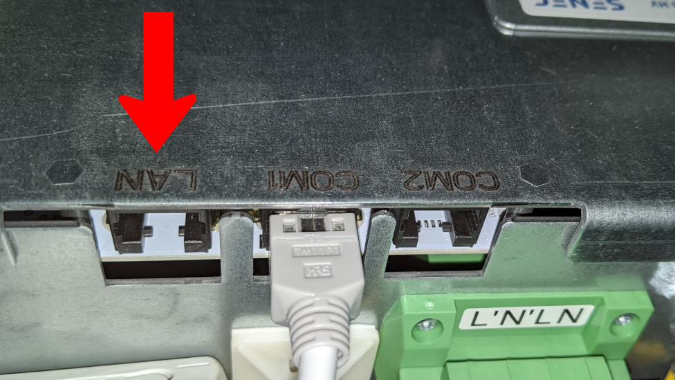

# Home Assistant Integration for SENEC.Home V2.x/V3/V4 Systems

This fork was created from [mchwalisz/home-assistant-senec](https://gitgub.com/mchwalisz/home-assistant-senec) mainly
because I wanted additional fields and some configuration options (like polling interval). Since I own a
__SENEC.Home V3 hybrid duo__ I can __only test my adjustments in such a configuration__.

But this does not imply, that this Integration is working only with V3 systems. The Integration should work with
multiple SENEC.Home Systems based on local `lala.cgi` calls.

Have that said - the __SENEC.Home V4__ will not come with a build-in web server that can be polled from your LAN. So
in order to support V4 this integration is polling (a limited amount of) data from the mein-senec.de web portal. The
__available data is__ (currently) __limited__ (only 13 sensor entities) and will be polled with a fix interval of 5
minutes.

__Thanks to [@mstuettgen](https://github.com/mstuettgen) developing the initial SENEC.Home V4 web-access! I hope you
support this repo in the future with possible enhancements for the WEB-API__.

## __Use this fork on your own risk!__

## Modifications (compared to the original version) in this fork

- Added User accessible configuration option
- Added configurable _update interval_ for the sensor data (I use _5_ seconds, without any issue)
- Reading DeviceID, DeviceType, BatteryType & Version information
- Added WebAPI access in order to support SENEC.Home V4
  Systems - [kudos @mstuettgen for the initial work!](https://github.com/mstuettgen/homeassistant-addons/tree/main/senecweb2mqtt)

  This WebAPI access is also usable for all other SENEC.Home Systems where the total-statistics data have been removed
  with the latest update by SENEC

  Please note, that currently the polling interval of 5 minutes is hardcoded!

- Additional Sensors:
    - For each MPP1, MPP2, MPP3 [potential (V), current (A) & power (W)]
    - For your EnFluRi-Net (Freq, potential, current, power)
    - For your EnFluRi-Usage (Freq, potential, current, power) [disabled by default]

    - Added BatteryCell Details [mainly disabled by default]
        - Module [A-D]: Current/Voltage/State of Charge (SoC)/State of Health (SoH)/Cycles
        - Cell temperature [1-6] per module [A-D]
        - Voltage per cell [1-14] per module [A-D]

    - Added Wallbox Details  [disabled by default]

    - If you connect the internal Inverter [in the case of the Duo there are even two (LV & HV)] to your LAN (see
      [details below](#inv-lnk)), then you can add these additional instances and directly access the data from the
      DC-AC
      converters

- Added Switch(es):
    - Added a switch to manually load the battery [state: 'MAN. SAFETY CHARGE' & 'SAFETY CHARGE READY'] (obviously this
      will use additional power from grid when your PV inverters will not provide enough power)

      _This switche might sound very foolish - but if you are not subscribed to the (IMHO total overpriced) SENEC-Cloud
      electricity tariff __and__ you have been smart and signed up for a dynamic price model (based on the current stock
      price) then loading your battery when the price is the lowest during the day might become a smart move (and also
      disallow battery usage while the price is average). Specially during the winter!_

    - EXPERIMENTAL: Added a switch to enable 'storage mode' [state: LITHIUM SAFE MODE DONE'] [disabled by default]

      The functionality of this switch is currently __not known__ - IMHO this will disable the functionality of the PV!
      __Please Note, that once enabled and then disable again the system will go into the 'INSULATION TEST' mode__ for a
      short while (before returning to normal operation)

- Modified _battery_charge_power_ & _battery_discharge_power_ so that they will only return data >0 when the system
  state is matching the corresponding CHARGE or DISCHARGE state (including state variants)

- Integrated variant of _pysenec_ python lib (almost every modification of this Home Assistant integration requires also
  an adjustment in the lib) - yes of course it would be possible to release also a lib derivative - but right now I am
  just a python beginner, and __I am lazy!__

- Added German Setup/GUI "translation" (not for the sensor's yet)

## Switching to this fork...

Please find in all information you need to know
when [Switching [to this] Fork](https://github.com/marq24/ha-senec-v3/issues/14) here in this overview

## Installation

### Hacs

- Install [Home Assistant Community Store (HACS)](https://hacs.xyz/)
- Add custom repository https://github.com/marq24/ha-senec-v3 to HACS
- Add integration repository (search for "SENEC.Home" in "Explore & Download Repositories")
    - Select latest version or `master`
- Restart Home Assistant to install all dependencies

### Manual

- Copy all files from `custom_components/senec/` to `custom_components/senec/` inside your config Home Assistant
  directory.
- Restart Home Assistant to install all dependencies

### Adding or enabling integration

#### My Home Assistant (2021.3+)

#### Manual

Add custom integration using the web interface and follow instruction on screen.

- Go to `Configuration -> Integrations` and add "SENEC.Home" integration
- Select the Integration Type (basically LAN ot WebApi)
- LAN: (`SENEC.Home V3 hybrid/SENEC.Home V3 hybrid duo` or `SENEC.Home V2.1 or older`
  or `Internal inverter build into SENEC.Home V3 hybrid/hybrid duo`)
    - Provide display name for the device, and it's address (hostname or IP)
    - Provide the update intervall
    - Provide area where the battery is located
- WebAPI (`WEB.API: mein-senec.de Portal (usable with all SENEC.Home variants)`
  or `SENEC.Home V4/SENEC.Home V4 hybrid`):
    - Provide display name for the device
    - Provide your mein-senec.de login credentials

You can repreat this to add additional Integration entries (e.g. LAN + WebAPI)

## Connecting the internal (build in) Senec Inverter Hardware to your LAN and use it in HA

The __SENEC.Home V3 hybrid duo__ have build in two inverters - called LV and HV. This hardware has its own LAN
connectors, but they have not been connected during the installation process (I guess by purpose).

### __DO THIS ON YOUR OWN RISK!__

Nevertheless, when you dismount the front and the right hand side panels you simply can plug in RJ45 LAN cables into
both of the inverters LAN connectors and after a short while you should be able to access the web frontends of the
inverters via your browser.

_Don't forget to assign fixed IP's to the additional inverter hardware. You can unplug the LAN cable for a short while
in order to make sure that the inverters will make use of the fixed assigned IP's._

### Position of SENEC.Inverter V3 LV LAN connector

On the front of the device

### Position of SENEC.Inverter V3 HV LAN connector _(hybrid duo only!)_

On the right hand side of the device

### Adding Inverter(s) to your HA

Once you have connected the inverter(s) with your LAN you can add another integration entry to your Senec Integration in
Home Assistant:

1. go to '__Settings__' -> '__Devices & Services__'
2. select the '__SENEC.Home__' integration.
3. there you find the '__Add Entry__' button (at the bottom of the '__Integration entries__' list)
4. specify the IP (or hostname) of the inverter you want to add
5. __important:__ assign a name (e.g. _INV_LV_).

Repeat step 3, 4 & 5 of this procedure, if you have build in two inverters into your Senec.HOME.

## Home Assistant Energy Dashboard

This integration supports Home Assistant's [Energy Management](https://www.home-assistant.io/docs/energy/)

Example setup:

Resulting energy distribution card:

# Developer information

If you are interested in some details about this implementation and the current known fields you might like to take a
look into the [current developer documentation section](./DEVELOPER_DOCUMENTATION.md) that was kindly provided
by [@io-debug](https://github.com/io-debug)
