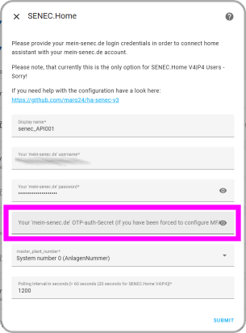

# Important information when you are requested to Setup SENEC OTP

First of all, you need to know, that currently (2025/08/05) the setup of the SENEC OTP is __not required__ when you want to use this HA integration.

SENEC OTP setup is __only required__ when you (as human) want to continue to access mein-senec.de with your web browser.

The integration will be able to support SENEC MFA authentication __but ONLY when you save the secret/key. It's essential that you copy the initial OTP secret__ during the setup process (or at least save the QR-Code image).

The QR-Code will contain a URL that looks like this:
```
otpauth://totp/SENEC:your-email%40example.com?secret=XXXXXXXXXXXXXXXXXXXXXXXXXXXXXXXX&digits=6&algorithm=SHA1&issuer=SENEC&period=30
```
The `secret` part is the information that you need to save, because it will be used to generate the OTP codes in the future.

There might be options, that you can access the secret of the OTP later, but this is not guaranteed. So I just can recommend, that you make sure to copy the secret __during the setup process__!

## When you setup the SENEC OTP

When you want (or must) access your mein-senec.de account, you will be initially requested to setup the MFA authentication (SENEC OTP). This is a one-time setup process, which is required to enable the MFA authentication for your account.

When you start the setup process, you will see a screen like this:


__First thing you should do is__, to right-click on the QR-Code image and "_Save image_" locally on your computer. This will allow you to access the QR-Code later, in case you need it again. _Of course keep this image at a save place, because it contains your secret!_

__Second thing you should do is__, to click on the link `QR-Code kann nicht gescannt werden` (marked purple on the screenshot) - when you click on this link, you will see a screen like this:


Here you can see the secret in plain text. You should copy and saved the text below the `Geheimer Schlüssel` at a safe place (e.g. in your password safe like Bitwarden or Keepass). So - just as example - you must copy the text `O5EG KN2U NNRX UNJS INVX M2T2 MIZE INJQ` from the dialog and save it securely (you will need it later when configure the login credentials for this HA Integration).

After you have copied & saved the plain text secret and the QR-Code image (as backup), you can go back to the initial setup screen by clicking on the link `QR-Code scannen` and then you can continue with the setup process and complete the SENEC's MFA authentication configuration.

Once you have completed this step - there is __no way back!__. From now on, you will be required to use the MFA authentication for your mein-senec.de account but also with this HA-Integration (Web/API part).

## After the MFA setup

__If you have completed the MFA authentication, via the mein-senec.de website, then you must provide the used secret__ (the copied plain text) __in the configuration of this HA integration__. The latest version of this integration will allow you to specify the OTA-auth-secret in the configuration.



## How to get the required otp-auth-secret from a QR-Code

When you have saved the QR-Code image, you can use a small tool I have created here in a separate GitHub project [QR-Code Reader, to decode the QR-Code and extract the `secret` you need for the integration](https://marq24.github.io/qr-code-decoder/).

This tool works strictly in your browser and does not store any data. The current version also supports to decode a QR-Code that you can generate from your Google Authenticator App (Export Codes functionality). Currently, it's unknown if such a functionality is also available for Microsoft Authenticator or other apps.

[The source code of this tool is of course also available here on GitHub](https://github.com/marq24/qr-code-decoder) - feel free to make a PR.