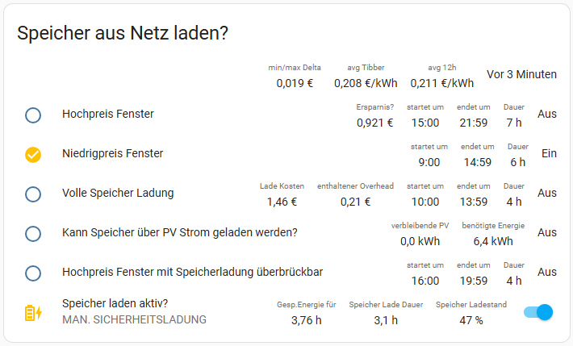

# Charge your Storage/Battery/Accumulator with Tibber when pcice is low

As a Tibber customer, I am paying the stock market price based on my hourly consumption. Additionally, I am a owner of
a 12 kWh Senec Storage/battery 'system', that will be charged via my PV, but can also be used to load power frm the
grid. Beside the positive effect by helping to stabilize the overall power network (consuming less when the price is
high), I can also benefit from the price when it is low.

In the past weeks I spend some time with finding a way to charge my storage/battery when the price is low. but consider
other aspects (like expected PV production) as well.

_Please note, that this guide requires some basic knowledge about Home Assistant and some manual steps that are not very
comfortable. But I hope it will help you to get started._

## Requirements / Preparation
### A Tibber price entity (REST API)
Probably you have already such an entry in your HA configuration (double check, if your structor is equivalent). If not,
all you need is a token from Tibber and the following configuration in your `configuration.yaml` file:

_Please note, if you have already a `sensor` section in your configuration, then you don't need to the first line
(`sensor:`) again._
```yaml
sensor:
  - platform: rest
    name: Tibber Prices
    unique_id: tibber_prices
    resource: https://api.tibber.com/v1-beta/gql
    method: POST
    payload: '{ "query": "{ viewer { homes { currentSubscription { status priceInfo { current { total startsAt level} today { total startsAt level} tomorrow { total startsAt level} } } } } }" }'
    json_attributes_path: "$.data.viewer.homes[0].currentSubscription.priceInfo"
    json_attributes:
      - current
      - today
      - tomorrow
    value_template: "{{ value_json.data.viewer.homes[0].currentSubscription.priceInfo.current.total | float }}"
    # we will update this integration via an automation - so no need of an scan_interval?!
    # at least every 24h (=60sec * 60min * 24h = 86400)
    scan_interval: 86400
    headers:
      Authorization: xxxxxxxxxxxxxxxxxxxxxxxxxxxxxxxxxxxxxxxxxx
      Content-Type: application/json
      User-Agent: REST
    unit_of_measurement: EUR/kWh
```
Where `xxxxxxxxxxxxxxxxxxxxxxxxxxxxxxxxxxxxxxxxxx` (in the headers section) must be replaced with your token, that you can
generate here: [https://developer.tibber.com/settings/accesstoken](https://developer.tibber.com/settings/accesstoken).

Additionally, I have added an HA automation triggering an update of my rest sensor every hour. __Please choose a
different slightly time delay, so that we do not overload (DOS) the Tibber API__:

```yaml
alias: "[POW] Update Tibber Prices Entity"
description: Update the Tibber Prices Entity ever hour (at 32 sec after full hour)
triggers:
  - hours: /1
    seconds: "32"
    trigger: time_pattern
conditions: []
actions:
  - data: {}
    target:
      entity_id: sensor.tibber_prices
    action: homeassistant.update_entity
mode: single
```

Make sure, that after a HA restart you have a `sensor.tibber_prices` entity in your HA entities list (e.g. Developer
Tools -> States).

### A Solar production forcast entity
In order to be able to judge, if your storage could not be loaded with expected PV energy the code must be able to get
the info how much kWh are expected for the current day.

I use here https://www.home-assistantio/integrations/forecast_solar/ to get the information. Since I have installed PV
on EAST and WEST side of my roof, I have two entities in my HA entities list and creaded a template sensor to sum up
both values.

### The Tibber Integration providing some price data for your home
Finally the last thing you need an entity that will be provided by the Tibber integration
istelf: https://www.home-assistant.io/integrations/tibber

## Installation
### Step 1: Collect your entities
In order to use all the stuff you must collect your local entity names:

- The Tibber stock price entity (e.g. `sensor.tibber_prices`)
- The Tibber home electricity price entity (e.g. `sensor.electricity_price_mmphome`)
- The Solar production forecast entity (e.g. `energy_production_today_remaining_sum`)
- The SOC (State of Charge) of your storage/battery (e.g. `sensor.senec_battery_charge_percent`)

Please store these information (e.g. in a clipboard) since we going to need this info multiple times in the next steps - like this:
```
sensor.tibber_prices
sensor.electricity_price_mmphome
sensor.energy_production_today_remaining_sum
sensor.senec_battery_charge_percent
```

### Step 2: Get the files...
You need to get the two files `pow_sensors.yaml` and `pow_vars.jinja2` here from gitgub:
- [pow_sensors.yaml](https://raw.githubusercontent.com/marq24/ha-senec-v3/refs/heads/master/docs/battery_control/pow_sensors.jinja)
    
  Store this file in your HA configuration directory under `config` directory.


- [pow_vars.jinja](https://raw.githubusercontent.com/marq24/ha-senec-v3/refs/heads/master/docs/battery_control/pow_vars.jinja)

  Store this file in your HA configuration directory in a subdirectory called `custom_templates` in your `config`
  directory. If such a `custom_templates` directory does not exist (which is very likly), create it first.

from the `custom_templates` and `config` directory of this repository and copy them to your HA configuration directory.

### Step 3: Adjustments 
#### Your HA `configuration.yaml` file [in `config` directory]
If you haven't already a `homeassistant` section in your `configuration.yaml` file, then you can add the following lines
to it (if you have already such a section just add the package):
```yaml
homeassistant:
  packages:
    power_calc: !include pow_sensors.yaml
```

#### The `pow_sensors.yaml` file [in `config` directory]

Open the `pow_sensors.yaml` file (e.g. with nano) and adjust the state triggers. The list of entities that will cause an update of the states of the entities in the `pow_sensors.yaml` file.

Just take the block you have created in step 1 and paste it into the `pow_sensors.yaml` file [and don't forget to use the right intent and don't forget the `-` (dash)] 

```yaml
  - trigger:
      - trigger: state
        entity_id:
          - sensor.tibber_prices
          - sensor.electricity_price_mmphome
          - sensor.senec_battery_charge_percent
          - sensor.energy_production_today_remaining_sum
```
The save the file and close the editor.

#### The `pow_vars.jinja2` file [in `config/custom_templates` directory]
Open the `pow_vars.jinja2` file (e.g. with nano) and adjust the upper part containing all your local configuration. You
can keep the default's but you must adjust the sensor entity section!

```yaml




```

The other part that you want to adjust are the average home consumption values. The script can use different values for
day and nighttime (e.g. here @ my home the heatpump is not running during the night). All values are in  kW/h. (and must
be estimated by you:

```yaml





```
If you don't want to use this feature, just set the `kw_per_hour_day` values and
`day_start = "0"|int` & `day_end = "0"|int`).

__Do not edit the rest of the file (below the lines)!__
```yaml
{# ############################ #}
{# END-OF-CONFIGURATION-OPTIONS #}
{# ############################ #}
{# DO NOT EDIT BELOW THIS LINE  #}
{# ############################ #}
```


### Step 4: Restart HA

### Step 5: An example Dashboard


This example dashboard requires the `custom:multiple-entity-row` card! https://github.com/benct/lovelace-multiple-entity-row
```yaml
type: vertical-stack
cards:
  - type: entities
    title: Speicher aus Netz laden?
    show_header_toggle: false
    state_color: true
    entities:
      - entity: sensor.pow_last_updated
        format: relative
        name: " "
        icon: none
        type: custom:multiple-entity-row
        entities:
          - entity: sensor.pow_tibber_overall_delta
            name: min/max Delta
            format: precision3
          - entity: sensor.pow_tibber_average_price
            format: precision3
            name: avg Tibber
            unit: €/kWh
          - entity: sensor.pow_average_price_from_now
            format: precision3
            name: avg 12h
            unit: €/kWh
      - entity: binary_sensor.pow_now_in_high_price_storage_independent_phase
        name: Hochpreis Fenster
        state_color: true
        type: custom:multiple-entity-row
        entities:
          - entity: sensor.pow_storage_usage_savings
            name: Ersparnis?
          - entity: sensor.pow_high_price_storage_independent_start
            name: startet um
            format: time
          - entity: sensor.pow_high_price_storage_independent_end
            name: endet um
            format: time
          - entity: sensor.pow_high_price_storage_independent_duration
            name: Dauer
      - entity: binary_sensor.pow_now_in_low_price_phase
        type: custom:multiple-entity-row
        name: Niedrigpreis Fenster
        state_color: true
        entities:
          - entity: sensor.pow_low_price_start
            name: startet um
            format: time
          - entity: sensor.pow_low_price_end
            name: endet um
            format: time
          - entity: sensor.pow_low_price_duration
            format: precision0
            name: Dauer
            unit: h
      - entity: binary_sensor.pow_now_in_cheapest_phase
        type: custom:multiple-entity-row
        name: Volle Speicher Ladung
        state_color: true
        entities:
          - entity: sensor.pow_storage_charging_cost
            name: Lade Kosten
            format: precision2
          - entity: sensor.pow_storage_charging_overhead_cost
            name: enthaltener Overhead
            format: precision2
          - entity: sensor.pow_cheapest_start
            name: startet um
            format: time
          - entity: sensor.pow_cheapest_end
            name: endet um
            format: time
          - entity: sensor.pow_cheapest_duration
            name: Dauer
      - entity: binary_sensor.pow_pv_power_can_fully_load_storage
        name: Kann Speicher über PV Strom geladen werden?
        state_color: true
        type: custom:multiple-entity-row
        entities:
          - entity: sensor.pow_pv_remaining_prod_home_usage
            format: precision1
            name: verbleibende PV
          - entity: sensor.pow_storage_full_charge_required_energy
            format: precision1
            name: benötigte Energie
      - entity: binary_sensor.pow_now_in_high_price_phase
        name: Hochpreis Fenster mit Speicherladung überbrückbar
        state_color: true
        type: custom:multiple-entity-row
        entities:
          - entity: sensor.pow_high_price_start
            name: startet um
            format: time
          - entity: sensor.pow_high_price_end
            name: endet um
            format: time
          - entity: sensor.pow_high_price_duration
            name: Dauer
      - entity: switch.senec_safe_charge
        type: custom:multiple-entity-row
        name: Speicher laden aktiv?
        state_color: true
        toggle: true
        secondary_info:
          entity: sensor.senec_system_state
          name: " "
        entities:
          - entity: >-
              sensor.pow_available_energy_duration_storage_pv_remaining_home_usage
            name: Gesp.Energie für
            unit: h
          - entity: sensor.pow_storage_full_charge_duration
            format: precision1
            name: Speicher Lade Dauer
            unit: h
          - entity: sensor.senec_battery_charge_percent
            format: precision0
            name: Speicher Ladestand
```

### Step 6: Finally - Adding the automations
#### START
Start Storage loading when price is low (please note that the is currently no price check included!) - obviously you
need a different switch (at the end) when you don't use this with the Senec HA integration:

```yaml
alias: "[POW] Load Storage [ON] when price is low (and remaining PV production is not sufficent)" 
description: ""
triggers:
  - trigger: state
    entity_id:
      - binary_sensor.pow_now_in_low_price_phase
      - binary_sensor.pow_pv_power_can_fully_load_storage
      - binary_sensor.pow_now_in_cheapest_phase
      - sensor.pow_low_price_duration
  - trigger: time_pattern
    hours: /1
    minutes: "1"
conditions: []
actions:
  - if:
      - condition: template
        value_template: >-
          {{(
            (states('binary_sensor.pow_now_in_low_price_phase')|lower == 'on') or
            (states('binary_sensor.pow_now_in_cheapest_phase')|lower == 'on')
          ) and
          states('binary_sensor.pow_pv_power_can_fully_load_storage')|lower == 'off' and
          states('sensor.pow_storage_full_charge_duration')|int > 0.49 and
          (
            (states('binary_sensor.pow_now_in_cheapest_phase')|lower == 'on') or
            (states('sensor.pow_storage_full_charge_duration') >= states('sensor.pow_low_price_duration'))
          )}}
    then:
      - entity_id: switch.senec_safe_charge
        action: switch.turn_on
mode: single
trace:
  stored_traces: 100
```
#### STOP
Stop Storage loading (and allow that energy from the storage can be used) when price is high - obviously you need a
different switch (at the end) when you don't use this with the Senec HA integration:

```yaml
alias: "[POW] Load Storage [OFF] when price is high (or remaining PV production is sufficent)"
description: ""
triggers:
  - trigger: state
    entity_id:
      - binary_sensor.pow_now_in_high_price_phase
      - binary_sensor.pow_now_in_low_price_phase
      - binary_sensor.pow_pv_power_can_fully_load_storage
  - trigger: time_pattern
    hours: /1
    minutes: 0
    seconds: 45
conditions: []
actions:
  - if:
      - condition: template
        value_template: >-
          {{
          states('binary_sensor.pow_now_in_high_price_phase')|lower == 'on' or
          states('binary_sensor.pow_now_in_low_price_phase')|lower == 'off' or
          states('binary_sensor.pow_pv_power_can_fully_load_storage')|lower == 'on'
          }}
    then:
      - entity_id: switch.senec_safe_charge
        action: switch.turn_off
mode: single
trace:
  stored_traces: 100
```